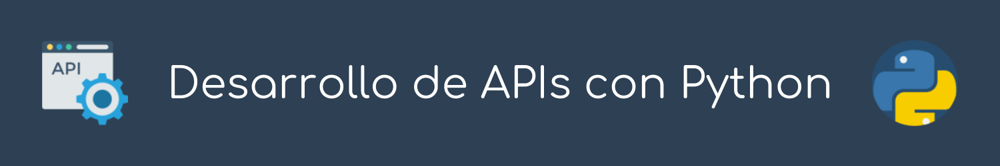

> #### Quick info:
>
> **Taller:** *Desarrollo de APIs con Python* <br>
> **Tallerista:** Rodolfo Ferro <br>
> **Twitter:** [@FerroRodolfo](https://twitter.com/FerroRodolfo) <br>
> **Contacto:** [https://rodolfoferro.xyz](https://rodolfoferro.xyz) <br>
> **Slides:** [¡Click aquí!](https://docs.google.com/presentation/d/e/2PACX-1vSc7Q82-lwQ8fKgR5WcT7Y0r9kotcYiNuyYjHRlF-fdhf6lkIrF9B_2akvzL-ZQ6ZAyT1lxM9f0mPdx/pub?start=false&loop=false&delayms=3000)
------


# Desarrollo de APIs con Python

En este taller se abordarán 4 puntos principales: 

1. Entender cómo funciona una API
2. Aprender a consumir APIs con PythonDayMX
3. Desarrollar nuestras propas APIs con Python
4. Concretar el contenido del taller con un ejemplo prático

Para lo anterior, se creará un servicio que utilice algún modelo (muy sencillo) de aprendizaje de máquina, a través de una REST API construida con Flask.

Para este taller se necesitan conocimientos básicos sobre programación en Python. Parte de los objetivos es que posterior al taller se cuente con material y conocimientos para poder extender y desarrollar servicios con Python, por supuesto. Para el taller se proporciona código base.

**Slides:** [¡Click aquí!](https://docs.google.com/presentation/d/e/2PACX-1vSc7Q82-lwQ8fKgR5WcT7Y0r9kotcYiNuyYjHRlF-fdhf6lkIrF9B_2akvzL-ZQ6ZAyT1lxM9f0mPdx/pub?start=false&loop=false&delayms=3000)


## ⚙️ Instalación

A continuación describo un par de maneras en las que puedes realizar las instalaciones correspondientes para seguir el taller.

### A. Instalación con `pip`

Preferentemente, la versión 19.0 de [pip](https://pip.pypa.io/en/stable/installing/), junto con [Python >= 3.6](https://www.python.org/downloads/) va a ser requerida.

Para instalar la lista de paquetes necesarios podemos utilizar `pip`. En este repositorio puedes encontrar un archivo `requirements.txt` con una lista de requerimientos. Estos requerimientos pueden ser instalados utilizando dicho archivo, para lo cual deberás correr lo siguiente en tu terminal:
```bash
# Clona el repo de GitHub:
git clone https://github.com/RodolfoFerro/PythonBaseAPI.git
cd PythonBaseAPI
pip install -r requirements.txt
```  

### B. Entorno virtual con Anaconda

La versión más reciente de [Anaconda](https://www.anaconda.com/download/) (3.7) con [Python >= 3.6](https://www.python.org/downloads/) va a ser requerida.

Para crear el `conda env` e instalar los requerimientos sólo clona el repo:
```bash
# Clona el repo de GitHub:
git clone https://github.com/RodolfoFerro/PythonBaseAPI.git
cd PythonBaseAPI
```

Y corre lo siguiente:
```bash
# Crea el entorno de Anaconda:
conda env create -f environment.yml
```

Para activar/desactivar el entorno:
```bash
# Activar entorno:
conda activate BaseAPI

# Desactivar entorno:
conda deactivate
```

### C. Para los intrépidos *–Developer Mode–*

Si te sientes intrépido y deseas no realizar instalaciones en tu máquina, puedes intentar trabajar en la nube utilizando [Google Colab](https://colab.research.google.com/), donde puedes acceder a notebooks en línea que ya cuentan con todos los requerimientos instalados en una instancia en la nube.

Cabe mencionar que este taller no ha sido desarrollado para trabajar de esta manera, ¡pero hey, tranquilo!; te daré una ayuda con [este Colab](https://colab.research.google.com/drive/1JwoRHn7GFTjHpy0gir5c8WYjp1C0_L8y)

## 👾 Contenido

El repositorio y taller están (en parte) autocontenidos, a través de los scripts dentro de la carpeta `code` del repositorio; además de que dentro de esta carpeta se encuentra otra (`full`) donde se encuentran los scripts completos.

**Slides:** [¡Click aquí!](https://docs.google.com/presentation/d/e/2PACX-1vSc7Q82-lwQ8fKgR5WcT7Y0r9kotcYiNuyYjHRlF-fdhf6lkIrF9B_2akvzL-ZQ6ZAyT1lxM9f0mPdx/pub?start=false&loop=false&delayms=3000)

***

### SOBRE EL USO DE INFORMACIÓN TOTAL O PARCIAL: 🔐
* Estos documentos fueron originalmente creados por el autor.
* Cualquier uso de estos documentos o sus contenidos están permitidos a través de la licencia provista y sus condiciones.
* Para cualquier aclaración, puedes contactar al autor: https://rodolfoferro.xyz/

**Copyright (c) 2019 Rodolfo Ferro**
